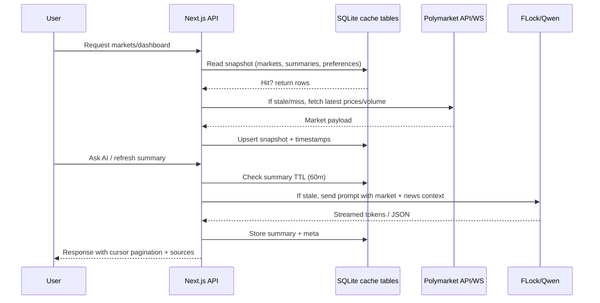

# PolyAlpha · Polymarket AI Alpha on Base

AI-powered intelligence layer for Polymarket. Base Mini App + web front-end built with Next.js App Router, RainbowKit/wagmi, and Prisma-backed SQLite/D1 caching. Surfaces trending markets, AI summaries, streaming Q&A, and wallet-bound watchlists without touching user funds.

## Why PolyAlpha
- Fast path to Alpha: cached AI market briefs, abnormal move alerts, and topic-filtered feeds.
- Wallet-native: RainbowKit on Base mainnet; watchlists and preferences are wallet-scoped.
- Polymarket-first: deep links back to trade; we never custody or place orders.
- Edge-ready: Node/Edge runtimes with optional Cloudflare D1 binding for persistence.
- Guarded AI: FLock/Qwen responses with keyword/mode moderation and rate limits.

## Quickstart
1) Install deps: `npm install`  
2) Copy envs: `cp .env.example .env.local` and fill keys (WalletConnect ID, Base RPC, FLock).  
3) Start dev server: `npm run dev` (defaults to http://localhost:3000).  
4) Run tests: `npm run test` (unit/integration) and `npm run test:e2e` (Playwright).  
5) Lint & build: `npm run lint` then `npm run build` or `npm run build:mini` for release flow.

## Configuration
| Env var | Purpose | Notes |
| --- | --- | --- |
| `NEXT_PUBLIC_WALLETCONNECT_PROJECT_ID` | RainbowKit WalletConnect ID | Optional; falls back to injected/Coinbase if empty. |
| `NEXT_PUBLIC_ENABLE_TESTNETS` | Expose Base testnets in wallet UI | `"true"` to enable. |
| `NEXT_PUBLIC_BASE_CHAIN_ID` / `BASE_RPC_URL` | Chain ID + RPC endpoint for Base | Defaults to mainnet 8453. |
| `FLOCK_API_KEY` / `FLOCK_MODEL` / `FLOCK_API_URL` | FLock (Qwen) API credentials | Used for AI summaries and Ask AI. |
| `ASK_AI_DAILY_LIMIT` | Per-wallet daily Ask AI cap | Integer; throttles abuse. |
| `POLYMARKET_API_BASE` | Override Polymarket HTTP base | Leave unset to use live Gamma API. |
| `POLYMARKET_WS_ENABLED` / `POLYMARKET_WS_URL` | Realtime price/volume feed | Disabled by default. |
| `SQLITE_DB_PATH` / `SQLITE_DATA_DIR` | SQLite location | Defaults to `./data/app.db`. |
| `DATABASE_URL` | Prisma connection string | Must align with SQLite/D1 target. |
| `APP_BASE_URL` | Absolute origin for server calls | e.g., `http://localhost:3000`. |
| `CONTRIBUTION_ADMIN_TOKEN` | Admin moderation secret | Sent via `x-admin-token` or Bearer. |
| Notification hooks | `TELEGRAM_*`, `EMAIL_WEBHOOK_*`, `FC_WEBHOOK_*` | Optional delivery channels. |

## Commands
| Command | What it does |
| --- | --- |
| `npm run dev` | Start Next.js dev server. |
| `npm run build` | Generate Prisma client then Next.js production build. |
| `npm run build:mini` | Lint, test, and build for Mini App release. |
| `npm run start` | Serve production build. |
| `npm run lint` | ESLint/Next.js checks. |
| `npm run test` | Vitest suite (API, domain, UI). |
| `npm run test:e2e` | Playwright smoke tests. |
| `npm run analyze` | Bundle analysis under `.next/analyze/**`. |
| `npm run jobs:snapshot` | Hydrate Polymarket snapshot + AI cache. |
| `npm run cron:push` | Push hot markets job. |
| `npm run cf:build`, `cf:dev`, `cf:deploy` | Cloudflare Pages build/preview/deploy. |
| `npm run cf:build:worker`, `cf:deploy:worker` | Cloudflare Workers (OpenNext) pipeline. |

## Architecture at a Glance
```mermaid
flowchart LR
  user[Client<br/>Base Mini App / Web] --> app[Next.js App Router<br/>(Edge + Node routes)]
  app --> api[API routes & server actions]
  api --> domain[Domain services<br/>(markets, insights, watchlists, contributions)]
  domain --> prisma[(Prisma proxy)]
  prisma --> db[(SQLite app.db<br/>or Cloudflare D1)]
  domain --> polymarket[Polymarket HTTP/WS<br/>market data]
  domain --> ai[FLock/Qwen<br/>AI inference]
  ai --> guardrails[Guardrails & rate limits]
  api --> logging[Structured logging + metrics]
```

## Data Lifecycle & Caching


## Feature Surface
- Markets: filter/sort by topic, liquidity, volume, 24h change; cursor-based pagination; optional WS updates.
- Market detail: price/volume chart, AI summary with 60m TTL, manual refresh, deep link to Polymarket.
- Ask AI: streamed or batched responses with short-term memory; per-wallet daily caps and moderation guardrails.
- Watchlist: wallet-bound favorites via `/api/markets/watchlist`.
- Insights: cadence-based AI sections with regeneration endpoints.
- Contributions: submit, moderate, and upvote market theses (wallet-scoped voting).

## Testing & Quality
- `npm run lint` for static checks.
- `npm run test` for domain, API, and component coverage (Vitest + Testing Library).
- `npm run test:e2e` for Playwright smoke across onboarding → dashboard → market detail.
- `npm run analyze` to watch bundle size before releases.

## Deployment Targets
- **Local / self-hosted:** `npm run build` then `npm run start`; ensure `DATABASE_URL` points to writable SQLite path.
- **Base Mini App:** publish the manifest with production URLs; keep WalletConnect/Base/FLock keys set in the host env.
- **Cloudflare Pages + D1:** use `npm run cf:build` → `npm run cf:dev` → `npm run cf:deploy`; D1 binding must be `DB`.
- **Cloudflare Workers (OpenNext):** `npm run cf:build:worker` then `npm run cf:deploy:worker`; uses the same `DB` binding.
- **Vercel (demo/read-only):** works with ephemeral FS; use remote SQLite if persistence is required.

## Safety & Guardrails
- Product is an intelligence layer only—no custody, no order routing.
- All AI output is moderated for blocked terms; exceeding Ask AI limits returns a throttled response.
- **Not investment advice.** Users should verify information before acting on Polymarket or elsewhere.

## Contributing
- Keep TypeScript strict; reuse domain services inside API routes.
- Favor cached reads and single Prisma client proxy; avoid opening new connections per request.
- Add tests for any new domain logic or API surface; mock external calls.
- Update environment instructions when introducing new configuration or jobs.
